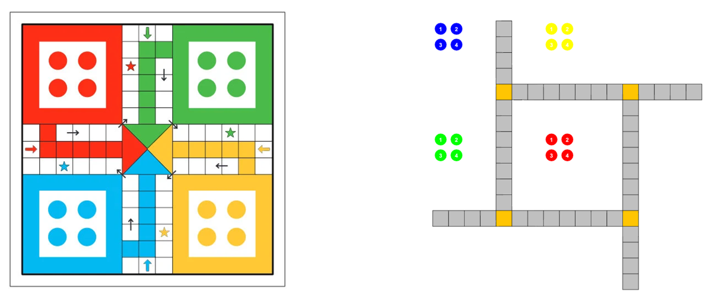
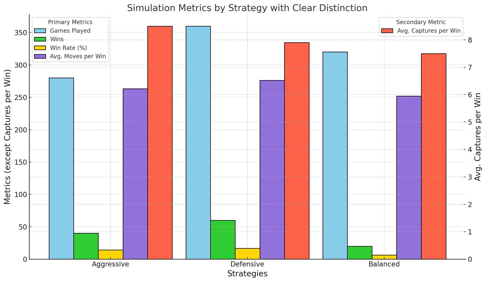

# 2024F CS2910 Project Report
**Group Members**
1. Ditthi Chatterjee (368797)
2. Mohammed Sahm (372021)

# Summary of Game
Ludo is a strategy-based board game for 2–4 players. Each player has four tokens and aims to move all of them from the 
starting area to the "home" space by rolling a die. The board is divided into four colored sections (red, blue, green, yellow), 
each corresponding to a player. Tokens move clockwise around the board. Players can send opponents’ tokens back to their start 
by landing on the same square. The first player to get all tokens "home" wins.
For detailed rules of traditional Ludo, visit https://en.wikipedia.org/wiki/Ludo_(board_game)#Rules

For project-specific instructions, refer to the details & instructions provided under "Human-Interactive Implementation & Game Instructions".

# Human-Interactive Implementation & Game Instructions
As an addition to this project, we implemented a human-interactive ludo game. The ludo game in this project is very similar to the traditional game, with very few differences. 
Some key differences in the game include:
1. **Total number of tiles each piece needs to reach home:** 
In a traditional Ludo game this number is 57, while in our project the total number of tiles needed is only 52.
2. **The graphic representation of the board:**
The board used in the GUI of the game closely resembles the structure of the Nodes we used to represent each tile. Each tile in the GUI is a node positioned from 0 to 51.

**For reference, here is the comparison between how a traditional board (left) looks like versus how our GUI board (right) looks like:**

**How to run the Game?**
It's simple!, once you have downloaded/cloned the repository, run the Main.java Class and you're good to go!

**Project-specific details in the game:**
1. The human-interactive version of the game only allows for one human player in the game.
2. The human player competes against 3 AI players during the game.
3. The movement of the tiles are slightly different from the traditional board game, thanks to the differences in the graphical representations. Each piece moves across each tile, once it reaches the end of a line, it moves onto the last crossed safe spot on the board and continues its way along the following line.
4. Gameplay instructions are first provided in the output window when the user runs the game program.

**Visual Demonstration of the movement of each tile on the board**

**How to Play the Game?**
1. Roll the dice when it is your turn.
2. Pick one available piece you want to move after each die roll.
3. The game ends when one of the players has all their pieces reach home!

# Experiment Report
## Player Strategies

1. Attack Strategy: The aggressive strategy heavily prioritizes capturing opponent pieces, assigning +200 points for potential captures. It aggressively seeks to get pieces out of base (+100 points when rolling a 6) and focuses on forward movement. This strategy takes more risks and values offensive play over safety, making it potentially powerful but vulnerable to counterattacks.

2. Defense Strategy: The defensive strategy emphasizes safety and protection, giving the highest priority (+200 points) to reaching safe spots. It's more cautious about leaving the base (+50 points for a 6) and assigns lower value to captures (+50 points) compared to the aggressive strategy. The focus is on protecting pieces and making steady, safe progress toward home.

3. Balanced Strategy: The balanced strategy combines elements of both aggressive and defensive play. It assigns moderate values to all actions: +150 points for leaving base with a 6, +100 points for captures, and +50 points for reaching safe spots. This creates a well-rounded approach that adapts to game situations, balancing opportunities for capture with the need for safety.

## Procedure of Simulation
The simulation experiment is designed to evaluate different AI strategies in the Ludo game. Here's how it works:

**Setup & Configuration:**

Runs 20 trials per configuration (NUM_TRIALS constant)
Maximum of 500 moves per game before declaring it stuck
Tests three strategies: Aggressive, Defensive, and Balanced
Runs both single-strategy games (all players using same strategy) and mixed-strategy combinations

1. Strategy Implementation:
    - Prioritizes moves as per points - capturing opponent pieces (+200 points), getting pieces out of base (+100 points), and advancing towards home.
    - Each strategy implements a scoring system to evaluate potential moves
    - AI players use these strategies to decide their moves based on the highest scoring move available 

2. Game Execution:
   - Each game has 4 players with different colored pieces (Red, Blue, Green, Yellow)
   - Players take turns rolling dice and moving pieces
   - Special rules to prevent stuck games:
     - Multiple roll attempts in late game (after 200 moves)
     - Guaranteed 6s in early game (first 100 moves)
     - Help for stuck players after 10 consecutive failed moves

3. Data Collection: The simulation tracks:
     - Wins per strategy
     - Total moves per strategy
     - Capture rates
     - Games played per strategy
     - Win rates (as percentages)
     - Average moves per win
     - Average captures per win

The results are compiled and displayed after all trials are complete, showing comparative performance statistics for each strategy.

## Results
The simulation analyzed the performance of Aggressive, Defensive, and Balanced strategies over 960 games, including mixed-strategy scenarios.
The Defensive strategy demonstrated the highest win rate (16.7%), followed by the Aggressive strategy (14.3%), while the Balanced strategy lagged significantly (6.3%).
On average, Balanced games concluded in the fewest moves (252.0), indicating a relatively fast playstyle, though not the most successful.
Aggressive games typically required 263.3 moves per win, reflecting their highly dynamic and confrontational nature. Defensive games were slower on average (276.3 moves per win),
but this slower pace yielded the most consistent results.

Notably, Aggressive strategies had the highest average captures per win (8.5), emphasizing their focus on elimination tactics.
In contrast, Defensive and Balanced strategies resulted in fewer captures per win, at 7.9 and 7.5 respectively,
underscoring their more positional or nuanced playstyles.

In mixed-strategy scenarios, Aggressive strategies generally outperformed Balanced strategies,
whereas Defensive strategies dominated other combinations, further validating their consistency and adaptability.

**Graphical Representation of All Metrics:**

**Tabular Information of Data Presented:**

| Metric                | Aggressive Strategy | Defensive Strategy | Balanced Strategy |
|-----------------------|---------------------|--------------------|-------------------|
| Games Played          | 280                 | 360                | 320               |
| Wins                  | 40                  | 60                 | 20                |
| Win Rate (%)          | 14.3                | 16.7               | 6.3               |
| Avg. Moves per Win    | 263.3               | 276.3              | 252.0             |
| Avg. Captures per Win | 8.5                 | 7.9                | 7.5               |

## Analysis of Strategy Performance
**1. Defensive Strategy**

Wins: 60 (16.7%) – highest among all strategies.
Average Moves per Win: 276.3 (longest).
Average Captures per Win: 7.9.

**Strengths:**
Defensive strategy has the highest win rate, reflecting superior consistency and effectiveness. It excels at outlasting opponents by prioritizing position and endurance, resulting in victories against diverse opponents. In mixed-strategy tests, it dominated both Aggressive and Balanced approaches, reinforcing its adaptability.

**Weaknesses:**
Defensive games take longer (276.3 moves on average), which may be less efficient in time-constrained scenarios. Additionally, with 7.9 captures per win, its reliance on gradual control sacrifices some offensive potential.

**2. Aggressive Strategy**

Wins: 40 (14.3%).
Average Moves per Win: 263.3.
Average Captures per Win: 8.5 – highest among all strategies.  

**Strengths:**
The Aggressive strategy has the highest captures per win (8.5), showcasing its ability to overwhelm opponents through eliminations. Its relatively faster pace (263.3 moves) suits players favoring direct, decisive gameplay. It performed well in mixed tests, frequently overpowering Balanced approaches.

**Weaknesses:**
With a lower win rate (14.3%), the Aggressive strategy lacks the consistency seen in Defensive approaches. Its confrontational style may lead to vulnerabilities in prolonged games or against more adaptable strategies.

**3. Balanced Strategy**

Wins: 20 (6.3%) – lowest among all strategies.
Average Moves per Win: 252.0 – shortest.
Average Captures per Win: 7.5 – lowest.

**Strengths:**
Balanced games concluded the fastest (252.0 moves), making it the most time-efficient strategy. This approach excels in mixed scenarios by leveraging both offensive and defensive elements but lacks a clear focus, making it versatile yet unspecialized.

**Weaknesses:**
The Balanced strategy’s low win rate (6.3%) reflects a lack of dominance in any particular area. Its low captures (7.5 per win) further indicate limited effectiveness in exerting direct pressure.

**Overall Conclusion:**

Defensive is the most consistent strategy, with the highest win rate and adaptability, making it ideal for longer, methodical games. Aggressive excels in fast-paced, elimination-focused play but sacrifices reliability. Balanced offers efficiency but struggles to outperform specialized strategies. Defensive’s robust performance across diverse scenarios makes it the most effective overall, while Aggressive suits players seeking high-stakes, action-oriented matches.

# Reflection

### What generative AI did we use, and what tasks did we use it for?
_**ChatGPT:** Assisted in debugging and understanding GUI code_ 
_**v0 by Vercel:** Generated base code for each class_ 
_**Cursor AI:** Helped re-write classes with necessary patches_

### How did you learn about the tools used by your group (delete ones that don't apply)?
_**ChatGPT:** Common word of mouth and popular usage_ 
_**v0 by Vercel:** Research through web forums and YouTube_ 
_**Cursor AI:** Pizza Seminar Lecture with Dr. Tamayo-Vera in November 2024_

### Reflecting on your experience:
**What Went Well**

One of the standout successes was using generative AI to implement the GUI (v0 and Cursor) and create a human-interactive game alongside the simulation experiment. ChatGPT, in particular, excelled at breaking down complex problems, teaching new concepts, and improving our understanding of coding structures. It helped us grasp unfamiliar ideas quickly, significantly enhancing our learning process.

Cursor AI provided efficient ideas and strategies for implementation, especially for designing the simulation’s strategy point system. v0 shone in writing precise code for specific strategies, which contributed to the depth and effectiveness of our simulations. Additionally, generative AI cut down our coding time, allowing us to focus more on refining and experimenting with strategies.

**What Didn’t Go Well**

Generative AI had its shortcomings, particularly in debugging. For instance, using v0 to implement patches often led to subsequent errors in related classes. While it quickly generated fixes, those fixes sometimes disrupted other parts of the program, necessitating manual review and debugging. This added extra steps to ensure the overall stability of the project.

**Limitations Encountered**

Generative AI’s code lacked modularity and reusability, which became evident as the project grew in complexity. Fixing multiple errors simultaneously and tracking corrections was challenging, as AI-generated solutions were often too narrowly focused and didn’t account for the bigger picture.

**Impact on Our Solution**

Generative AI helped us evolve the project in several ways. The addition of a GUI and the implementation of better strategies were direct results of insights from these tools. Cursor AI improved the quality of strategies implemented, while ChatGPT provided valuable feedback that led to more refined, modular, and efficient code in v0. Together, these tools enhanced the project's overall functionality and depth.

**What Could Be Improved**

To improve the project, we could have dedicated more time to understanding the tools and principles we relied on, such as Java Swing (for GUI) and TDD (Test-Driven Development). With better preparation, we could have reduced our dependency on generative AI for creating tests. Additionally, exploring other generative AI tools or understanding the ones we used in greater detail might have further enhanced the project.

**Conclusion**

Generative AI was an invaluable asset for this project, streamlining workflows and accelerating development. However, its limitations in debugging, modularity, and handling large-scale programming emphasized the need for human oversight and a strong foundational understanding of core programming concepts. Balancing AI assistance with manual expertise would lead to even better outcomes in future projects.

# Bonus Consideration:

We would like you to consider the following aspects of the project for available bonus:
1. Successful implementation of a Human-interactive Game.
2. Advanced use of Java concepts, including Nodes, functional interfaces and Exceptions.
3. GUI Implementation of the Ludo Game using Swing.
4. Effective Simulation Experiment that collects multiple metrics for data analysis.
